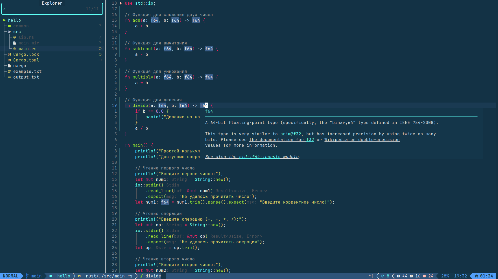

# My Enhanced Theme

Профессиональная цветовая схема для Neovim



## Установка
```lua
{
  "Chiptune11/my_enhanced_theme",
  lazy = false,
  priority = 1000,
  config = function()
    vim.cmd.colorscheme("my_enhanced_theme")
  end
}
```
### Вручную
Скопируйте содержимое `colors/` в `~/.config/nvim/colors/`

## Особенности
- Оптимизированная цветовая палитра
- Поддержка Treesitter и LSP
- Интеграция с популярными плагинами

## Дополнительные плагины

Для полной функциональности темы рекомендуется установить:

- [rainbow-delimiters.nvim](https://github.com/HiPhish/rainbow-delimiters.nvim)
```lua
require("my_enhanced_theme.rainbow").setup()
```
